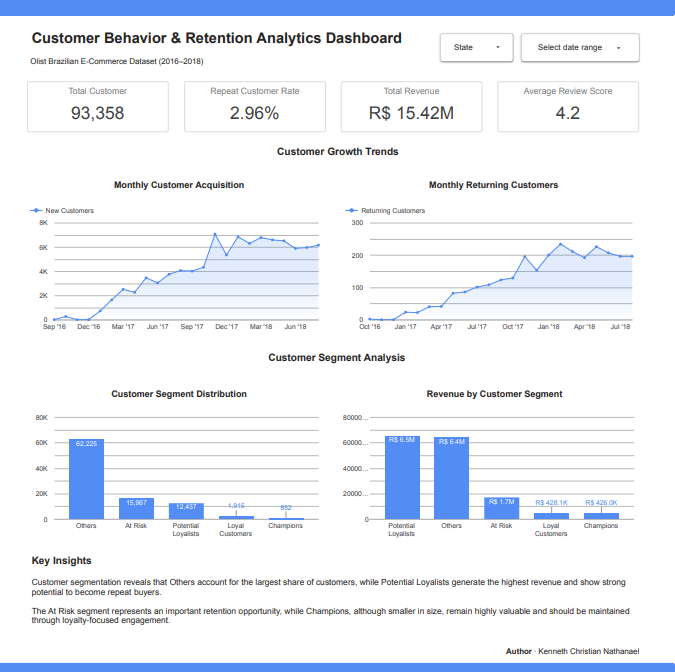
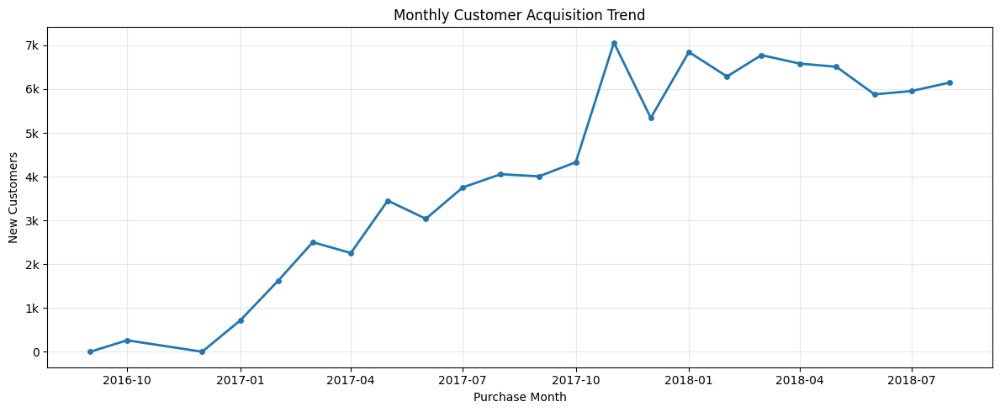
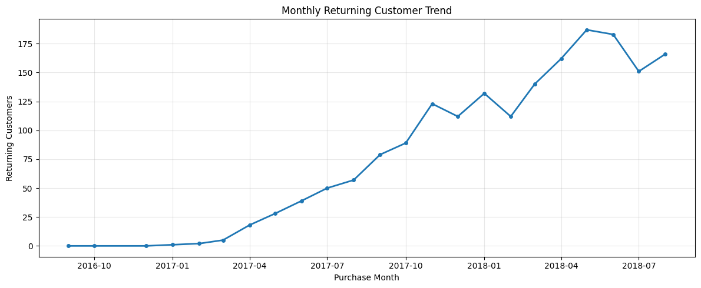
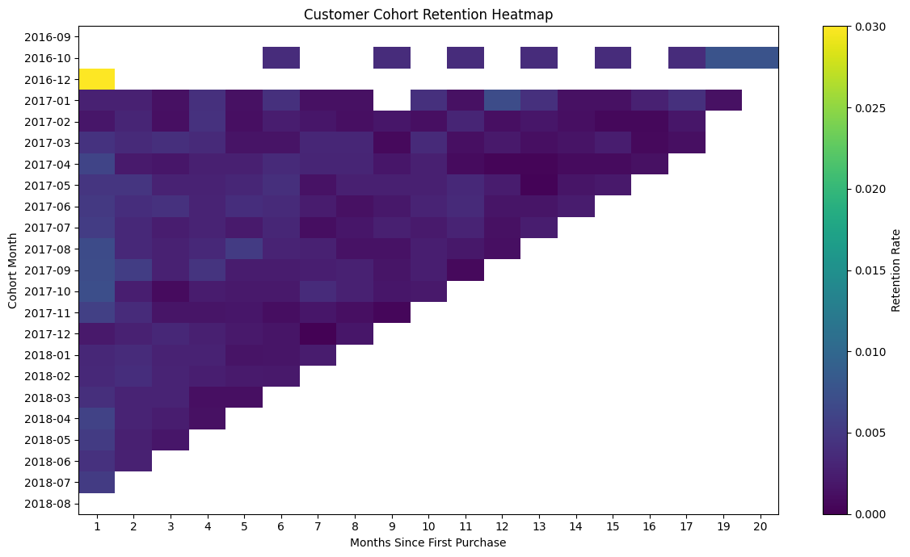
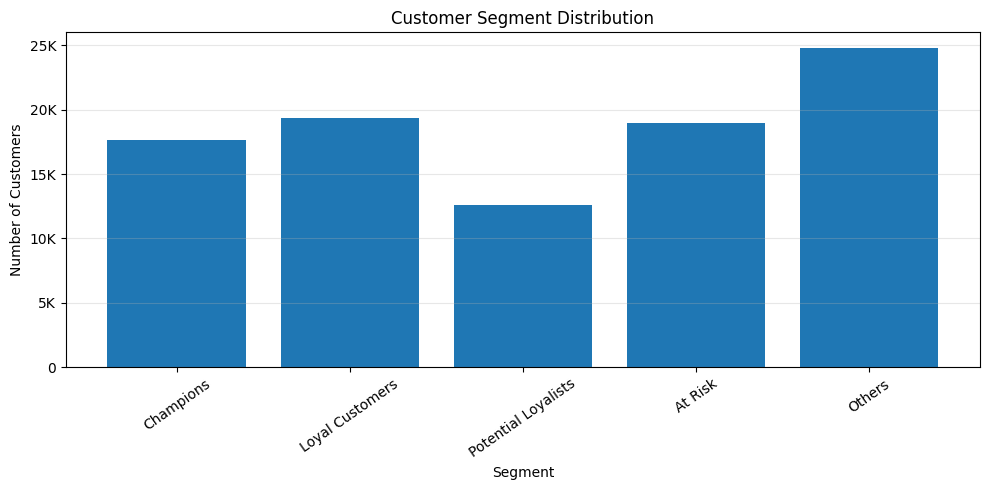
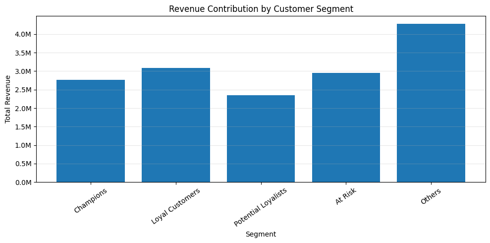

# Customer Behavior & Retention Analytics — Olist Brazilian E-Commerce


## Overview

This project analyzes customer purchasing behavior and retention patterns using the Brazilian E-Commerce Public Dataset by Olist.

The analysis focuses on customer acquisition growth, repeat customer behavior, cohort retention performance, and customer segmentation to identify retention opportunities and support long-term business decisions.

Data extraction and transformation were performed using Google BigQuery (SQL), while Python was used for analysis and visualization. An interactive dashboard was created using Looker Studio.

---

## Project Objective

The objective of this project is to analyze customer behavior and retention performance across the Olist marketplace.

This analysis focuses on:

- customer acquisition trends
- repeat customer behavior
- cohort retention analysis
- customer segmentation
- revenue contribution by customer segment

The goal is to identify customer retention opportunities and generate business recommendations based on purchasing behavior.

---

## Tools Used

- Google BigQuery (SQL)
- Python (Google Colab)
- Pandas
- Matplotlib
- Google Looker Studio
- GitHub

---

## Dataset

Source:

Olist Brazilian E-Commerce Public Dataset

https://www.kaggle.com/datasets/olistbr/brazilian-ecommerce

Raw source files are not included in this repository due to file size limitations.

---

## Data Schema


---

## Dashboard Overview

### Customer Behavior & Retention Analytics Dashboard



Interactive dashboard:

https://datastudio.google.com/s/oh7wi44hxh8

PDF version:

[Download Dashboard PDF](dashboard/Customer_Behavior_Retention_Dashboard.pdf)

---

## Notebook

Google Colab:

https://colab.research.google.com/drive/1eagtvB6yyUqR2csBWYuq-6WCVYN6N5oL?usp=sharing

Local notebook file:

/notebook/Customer_Behavior_and_Retention_Analytics_Olist.ipynb

---

## SQL Workflow

### Data Quality Check

- missing value validation
- duplicate validation

### Customer Master Table

Customer-level dataset containing:

- first purchase date
- last purchase date
- total orders
- total revenue
- average order value
- average review score

### Customer Acquisition Trend

Monthly new customer trend.

### Returning Customer Trend

Monthly repeat customer trend.

### Cohort Retention

Customer retention by cohort.

### Customer Segment View

Segment classification for dashboard analysis.

---

## Python Visualizations

### Monthly Customer Acquisition



### Monthly Returning Customers



### Cohort Retention Heatmap



### Customer Segment Distribution



### Revenue by Customer Segment



---

## Key Insights

Customer acquisition increased steadily throughout the analysis period and reached its highest level near the end of 2017 before stabilizing.

Returning customer activity also improved consistently over time, indicating stronger customer retention as the marketplace matured.

Cohort retention analysis shows that repeat purchases happen most frequently shortly after first purchase before gradually declining over time.

Customer segmentation reveals that the **Others** segment contains the largest customer base, while **Potential Loyalists** contribute the highest revenue.

The **At Risk** segment represents a meaningful retention opportunity, while **Champions** remain valuable despite smaller volume.

---

## Repository Structure

```bash
customer-behavior-retention-analytics-olist/
│
├── assets/
├── dashboard/
├── data/
├── notebook/
├── sql/
└── README.md
```

---

## Author

Kenneth Christian Nathanael
